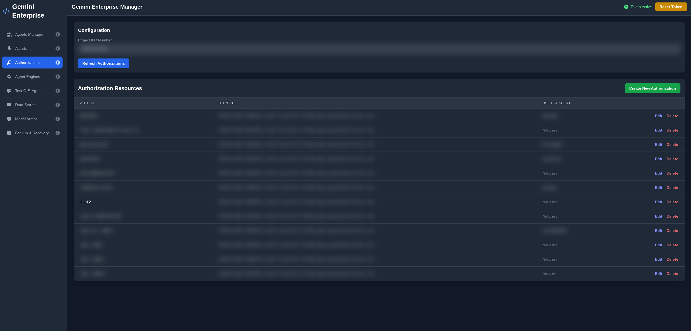

# Gemini Enterprise Manager

A web interface to manage Google Cloud Gemini Enterprise resources, including agents, authorizations, and reasoning engines. This UI provides a user-friendly way to perform operations similar to the `gcloud` CLI tool for Gemini Enterprise. It includes a guided setup process to validate and enable necessary Google Cloud APIs, making project configuration straightforward.

This application is built using React and communicates with Google Cloud APIs via the **Google API JavaScript Client (`gapi`)**.

## Screenshots

> **Note:** Ensure you have a `screenshots/` folder in your repository root containing these images for them to appear.

| Agent Manager | Available Agents |
|:---:|:---:|
|  |  |

| Assistant | Authorizations |
|:---:|:---:|
|  |  |

## Key Features

-   **Manage Agents**: List, create, update, delete, enable/disable, and chat with agents.
-   **Manage Authorizations**: List, create, update, and delete OAuth client authorizations.
-   **Manage Reasoning Engines**: List engines, view agent dependencies, terminate sessions, and delete unused engines.
-   **Architecture Visualizer**: Scans your project to discover all Gemini Enterprise resources and renders an interactive, top-down graph of their relationships and dependencies.
-   **Agent Builder**: A powerful UI to construct agents. Supports creating both **Vertex AI Agent Engine (ADK)** agents and **Cloud Run (A2A)** functions. It automatically generates Python code (`agent.py` / `main.py`), environment files, and deployment scripts.
-   **Agent Catalog**: Browse sample agents from GitHub repositories and deploy them directly to your project using Cloud Build.
-   **Explore Data Stores**: List data stores within a collection, view their details, and inspect individual documents and their content.
-   **Manage Licenses**: View assigned user licenses, resolve license configuration names, and revoke specific licenses.
    -   **Auto-Pruner Generator**: Includes a built-in wizard to generate and deploy a serverless Cloud Run function that automatically prunes inactive user licenses based on a configurable schedule.
-   **Model Armor Log Viewer**: Fetch and inspect safety policy violation logs from Cloud Logging.
-   **Comprehensive Backup & Restore**: Backup and restore agents, assistants, data stores, authorizations, and entire Discovery Engine configurations.
-   **Guided Setup & API Validation**: An initial setup screen that validates if all required GCP APIs are enabled for your project and provides a one-click solution to enable any that are missing.

### Beta Features

-   **Project Cost Estimator**: Scans for active resources (Reasoning Engines, Vertex AI Search Apps, Cloud Run services) and queries the **Cloud Monitoring API** to fetch real-time usage metrics (e.g., request counts, node hours) to help estimate costs.
-   **Test Agent (Chat)**: A dedicated, full-page interface for chatting with a Gemini Enterprise engine/assistant to test the overall conversational experience.
-   **Manage Assistant**: View and edit the settings of the default assistant for a Gemini Enterprise Engine, including system instructions, grounding settings, and enabled tools.
-   **Cloud Run Agents**: Scan for and inspect Cloud Run services to identify deployed agents (A2A or standard).
-   **Explore MCP Servers**: Scan for Cloud Run services in a specified region and identify potential Model Context Protocol (MCP) servers.

## Prerequisites

Before using this application, ensure you have the following:

1.  **A Google Cloud Project**: Your resources will be managed within a specific GCP project.
2.  **Enabled APIs**: The app includes a validation tool, but generally requires:
    -   Discovery Engine API
    -   AI Platform (Vertex AI) API
    -   Cloud Resource Manager API
    -   Cloud Logging API
    -   Cloud Run Admin API
    -   Cloud Storage API
    -   Service Usage API
    -   Cloud Monitoring API (for Cost Assessment)

## Configuration & Setup

### 1. Configure Google Sign-In (OAuth)

To use the "Sign in with Google" feature, you must configure an OAuth Client ID in your Google Cloud Project.

1.  Go to **APIs & Services > Credentials** in the Google Cloud Console.
2.  Click **Create Credentials** -> **OAuth client ID**.
3.  Select **Web application** as the application type.
4.  **Important:** Under **Authorized JavaScript origins**, you must add the URL where this app is running.
    *   For local development: `http://localhost:3000` (or your specific port).
    *   For Cloud Run deployment: `https://your-service-name-uc.a.run.app`.
    *   *Note: If you do not add the correct origin, you will see an "idpiframe_initialization_failed" or "Cookies are not enabled" error.*
5.  Copy the **Client ID** and update the `GOOGLE_CLIENT_ID` constant in `App.tsx` (or use an environment variable).

### 2. Local Development

1.  **Install Dependencies**:
    ```sh
    npm install
    ```
2.  **Start the Development Server**:
    ```sh
    npm run dev
    ```
    Open `http://localhost:3000` in your browser.

## Deployment to Cloud Run

You can deploy this frontend application to Google Cloud Run to make it accessible to your team.

### Option 1: Continuous Deployment from Git (Recommended)

This method sets up automatic deployments whenever you push to your git repository using Google Cloud Buildpacks.

1.  **Push your code** to a git repository (GitHub, Bitbucket, or Cloud Source Repositories).
2.  Go to **Cloud Run** in the Google Cloud Console and click **Create Service**.
3.  Select **Continuously deploy new revisions from a source repository**.
4.  Click **Set up with Cloud Build** and connect your repository.
5.  **Build Configuration**:
    *   **Build Type**: Select **Googla Cloud Buildpacks**.
    *   **Build context directory**: `.` (or leave as default).
    *   **Entrypoint**: Leave **Empty** (The buildpack automatically detects the `npm start` script).
    *   **Function target**: Leave **Empty**.
6.  **Authentication**: Select **Allow unauthenticated invocations** (The app handles authentication internally via Google Sign-In).
7.  Click **Create**.

Once deployed, remember to copy the **Service URL** and add it to your OAuth Client ID's **Authorized JavaScript origins** (see Configuration step above).

### Option 2: Manual Deployment via CLI (Docker)

If you prefer to build the container manually or use a custom Dockerfile.

1.  **Create a Dockerfile**:
    Create a file named `Dockerfile` in the root of the project with the following content:

    ```dockerfile
    # Build Stage
    FROM node:20-slim AS build
    WORKDIR /app
    COPY package*.json ./
    RUN npm install
    COPY . .
    # Build the Vite app (outputs to /dist)
    RUN npm run build

    # Serve Stage
    FROM node:20-slim
    WORKDIR /app
    # Install a simple static file server
    RUN npm install -g serve
    # Copy built assets from the build stage
    COPY --from=build /app/dist ./dist
    # Expose port 8080 (Cloud Run default)
    EXPOSE 8080
    # Start the server
    CMD ["serve", "-s", "dist", "-l", "8080"]
    ```

2.  **Build and Deploy**:
    Run the following command using the Google Cloud CLI:

    ```sh
    gcloud run deploy gemini-manager \
      --source . \
      --project [YOUR_PROJECT_ID] \
      --region us-central1 \
      --allow-unauthenticated
    ```

## Setup Automated License Pruner

This application includes a tool to automate the revocation of licenses for inactive users.

1.  Navigate to the **Licenses** page in the app.
2.  Click the **"Setup Auto-Pruner"** button.
3.  Configure your settings (Prune threshold days, Region, etc.).
4.  Click **Download Deployment Package**.
5.  Unzip the package and run the included `deploy.sh` script in your terminal.

This script will:
*   Create a dedicated Service Account.
*   Grant minimal necessary permissions (`discoveryengine.admin`, `serviceusage.serviceUsageConsumer`).
*   Deploy a Python function to Cloud Run.
*   Create a Cloud Scheduler job to invoke the function daily.

## Underlying Google Cloud APIs

The application uses the Google API JavaScript Client (`gapi`) for all interactions. Below are examples of the underlying REST calls.

### Agents
```sh
curl -X GET \
  -H "Authorization: Bearer [TOKEN]" \
  "https://discoveryengine.googleapis.com/v1alpha/projects/[PROJECT]/locations/global/collections/default_collection/engines/[APP_ID]/assistants/default_assistant/agents"
```

### Cost Usage (Cloud Monitoring)
```sh
curl -X GET \
  -H "Authorization: Bearer [TOKEN]" \
  "https://monitoring.googleapis.com/v3/projects/[PROJECT]/timeSeries?filter=metric.type%3D%22run.googleapis.com%2Frequest_count%22&interval.startTime=...&interval.endTime=..."
```

### A2A Agent Discovery
```sh
curl -X GET \
  -H "Authorization: Bearer [IDENTITY_TOKEN]" \
  "https://[CLOUD_RUN_URL]/.well-known/agent.json"
```
