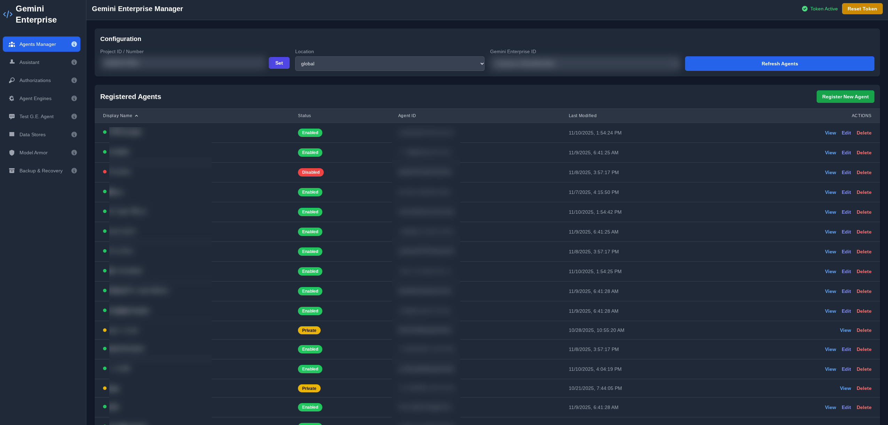

# Gemini Enterprise Manager

A web interface to manage Google Cloud Gemini Enterprise resources, including agents, authorizations, and reasoning engines. This UI provides a user-friendly way to perform operations similar to the `gcloud` CLI tool for Gemini Enterprise. It includes a guided setup process to validate and enable necessary Google Cloud APIs, making project configuration straightforward.

This application is built using React and communicates with Google Cloud APIs via the **Google API JavaScript Client (`gapi`)**.

## Screenshots

> **Note:** Ensure you have a `screenshots/` folder in your repository root containing these images for them to appear.

| Agent Management | Architecture Visualizer |
|:---:|:---:|
|  |  |

| Agent Builder | Dark Mode UI |
|:---:|:---:|
|  |  |

## Key Features

-   **Manage Agents**: List, create, update, delete, enable/disable, and chat with agents.
-   **Manage Assistant**: View and edit the settings of the default assistant for a Gemini Enterprise Engine, including system instructions, grounding settings, and enabled tools.
-   **Test Assistant**: A dedicated, full-page interface for chatting with a Gemini Enterprise assistant to test the overall conversational experience.
-   **Manage Authorizations**: List, create, update, and delete OAuth client authorizations.
-   **Manage Reasoning Engines**: List engines, view agent dependencies, and delete unused engines.
-   **Explore Data Stores**: List data stores within a collection, view their details, and inspect individual documents and their content.
-   **Model Armor Log Viewer**: Fetch and inspect safety policy violation logs from Cloud Logging.
-   **Comprehensive Backup & Restore**: Backup and restore agents, assistants, data stores, authorizations, and entire Discovery Engine configurations.
-   **Guided Setup & API Validation**: An initial setup screen that validates if all required GCP APIs are enabled for your project and provides a one-click solution to enable any that are missing.

### Beta Features

-   **Architecture Visualizer**: Scans your project to discover all Gemini Enterprise resources and renders an interactive, top-down graph of their relationships and dependencies.
-   **Agent Builder**: A powerful UI to construct ADK-based agents from scratch. It automatically generates the necessary Python code (`agent.py`), environment (`.env`), and dependency (`requirements.txt`) files. Features include:
    -   A tool builder for easily adding Vertex AI Search tools.
    -   Options to download the complete agent code as a `.zip` file.
    -   An integrated uploader to stage agent files (`agent.pkl` and `requirements.txt`) directly to a GCS bucket.
    -   A deployment wizard to deploy the staged agent to a new or existing Reasoning Engine.
-   **A2A Function Builder**: A tool to generate the source code (`main.py`, `Dockerfile`, `requirements.txt`) for a secure, serverless A2A (Agent-to-Agent) function on Cloud Run.
-   **Agent Registration**: A guided UI to register a deployed A2A function with a Gemini Enterprise Engine, making it discoverable as a tool.
-   **A2A Tester**: A simple utility to test the discovery endpoint (`agent.json`) of a deployed A2A function.
-   **Explore MCP Servers**: Scan for Cloud Run services in a specified region. Identifies potential MCP servers if a service's labels contain "MCP". Provides a detailed view of each service's configuration.

## Prerequisites

Before using this application, ensure you have the following:

1.  **A Google Cloud Project**: Your resources will be managed within a specific GCP project.
2.  **Enabled APIs**: Make sure the following APIs are enabled for your project:
    -   Discovery Engine API
    -   AI Platform (Vertex AI) API
    -   Cloud Resource Manager API
    -   Cloud Logging API
    -   Cloud Run Admin API
    -   Cloud Storage API
    -   Service Usage API
3.  **`gcloud` CLI**: You need the Google Cloud CLI installed and authenticated to obtain an access token.
4.  **Access Token**: Generate a temporary access token by running the following command in your terminal:
    ```sh
    gcloud auth print-access-token
    ```

## How to Run

This method is recommended for development and uses the standard Node.js ecosystem.

1.  **Install Dependencies**: Open your terminal in the project's root directory and run:
    ```sh
    npm install
    ```
2.  **Start the Development Server**: Once installation is complete, start the server:
    ```sh
    npm run dev
    ```
    This command will launch a development server and should automatically open the application in your default browser (usually at `http://localhost:3000` or a similar address).
3.  **Configure the App**:
    -   Paste the access token generated from the `gcloud` command into the **"Paste GCP Access Token"** field.
    -   Follow the on-screen instructions to set your GCP Project ID/Number and validate/enable the required APIs.
4.  **Ready to Use**: You can now use the application to manage your Gemini Enterprise resources.

## Underlying Google Cloud APIs

While the application uses the Google API JavaScript Client (`gapi`) for all interactions, the following `curl` examples illustrate the underlying REST API calls for each major feature. This is useful for reference, testing, and understanding the raw API endpoints.

You will need to replace placeholders like `[YOUR_PROJECT_ID]` and `[YOUR_ACCESS_TOKEN]` with your own values.

### List of APIs Used

The application interacts with the following Google Cloud APIs, using their respective discovery documents for client library initialization:

-   [Gemini Enterprise API (v1alpha)](https://discoveryengine.googleapis.com/$discovery/rest?version=v1alpha)
-   [Gemini Enterprise API (v1beta)](https://discoveryengine.googleapis.com/$discovery/rest?version=v1beta)
-   [Vertex AI API (v1beta1)](https://aiplatform.googleapis.com/$discovery/rest?version=v1beta1)
-   [Cloud Resource Manager API (v1)](https://cloudresourcemanager.googleapis.com/$discovery/rest?version=v1)
-   [Cloud Logging API (v2)](https://logging.googleapis.com/$discovery/rest?version=v2)
-   [Cloud Run Admin API (v2)](https://run.googleapis.com/$discovery/rest?version=v2)
-   [Cloud Storage API (v1)](https://www.googleapis.com/discovery/v1/apis/storage/v1/rest)
-   [Service Usage API (v1)](https://serviceusage.googleapis.com/$discovery/rest?version=v1)

---

### Examples by Feature

#### **Agents Tab**

**List Agents:** Retrieves all agents within a specific assistant.

```sh
curl -X GET \
  -H "Authorization: Bearer [YOUR_ACCESS_TOKEN]" \
  -H "X-Goog-User-Project: [YOUR_PROJECT_ID]" \
  "https://[LOCATION]-discoveryengine.googleapis.com/v1alpha/projects/[YOUR_PROJECT_ID]/locations/[LOCATION]/collections/[COLLECTION_ID]/engines/[ENGINE_ID]/assistants/[ASSISTANT_ID]/agents"
```

**Create an Agent:** Registers a new ADK agent linked to a Reasoning Engine.

```sh
curl -X POST \
  -H "Authorization: Bearer [YOUR_ACCESS_TOKEN]" \
  -H "Content-Type: application/json" \
  -H "X-Goog-User-Project: [YOUR_PROJECT_ID]" \
  -d '{
        "displayName": "My API Agent",
        "adkAgentDefinition": {
          "tool_settings": { "tool_description": "A tool that can call APIs." },
          "provisioned_reasoning_engine": {
            "reasoning_engine": "projects/[YOUR_PROJECT_ID]/locations/[RE_LOCATION]/reasoningEngines/[RE_ID]"
          }
        }
      }' \
  "https://[LOCATION]-discoveryengine.googleapis.com/v1alpha/projects/[YOUR_PROJECT_ID]/locations/[LOCATION]/collections/[COLLECTION_ID]/engines/[ENGINE_ID]/assistants/[ASSISTANT_ID]/agents"
```

#### **Assistant Tab**

**Get Assistant Details:** Retrieves the configuration of the default assistant.

```sh
curl -X GET \
  -H "Authorization: Bearer [YOUR_ACCESS_TOKEN]" \
  -H "X-Goog-User-Project: [YOUR_PROJECT_ID]" \
  "https://[LOCATION]-discoveryengine.googleapis.com/v1alpha/projects/[YOUR_PROJECT_ID]/locations/[LOCATION]/collections/default_collection/engines/[ENGINE_ID]/assistants/[ASSISTANT_ID]"
```

#### **Authorizations Tab**

**List Authorizations:** Retrieves all OAuth authorizations for the project.

```sh
curl -X GET \
  -H "Authorization: Bearer [YOUR_ACCESS_TOKEN]" \
  -H "X-Goog-User-Project: [YOUR_PROJECT_ID]" \
  "https://discoveryengine.googleapis.com/v1alpha/projects/[YOUR_PROJECT_ID]/locations/global/authorizations"
```

**Create an Authorization:** Creates a new OAuth authorization resource.

```sh
curl -X POST \
  -H "Authorization: Bearer [YOUR_ACCESS_TOKEN]" \
  -H "Content-Type: application/json" \
  -H "X-Goog-User-Project: [YOUR_PROJECT_ID]" \
  -d '{
        "serverSideOauth2": {
          "clientId": "[YOUR_OAUTH_CLIENT_ID]",
          "clientSecret": "[YOUR_OAUTH_CLIENT_SECRET]",
          "authorizationUri": "https://accounts.google.com/o/oauth2/auth?...",
          "tokenUri": "https://oauth2.googleapis.com/token"
        }
      }' \
  "https://discoveryengine.googleapis.com/v1alpha/projects/[YOUR_PROJECT_ID]/locations/global/authorizations?authorizationId=[NEW_AUTH_ID]"
```

#### **Agent Engines Tab**

**List Reasoning Engines:** Retrieves all Reasoning Engines in a specific location.

```sh
curl -X GET \
  -H "Authorization: Bearer [YOUR_ACCESS_TOKEN]" \
  -H "X-Goog-User-Project: [YOUR_PROJECT_ID]" \
  "https://[LOCATION]-aiplatform.googleapis.com/v1beta1/projects/[YOUR_PROJECT_ID]/locations/[LOCATION]/reasoningEngines"
```

#### **Chat Tab**

**Chat with an Assistant (Streaming):** Sends a prompt to a G.E. Assistant and receives a streaming response. This is the primary method for testing the overall conversational experience.

```sh
curl -X POST \
  -H "Authorization: Bearer [YOUR_ACCESS_TOKEN]" \
  -H "Content-Type: application/json" \
  -H "X-Goog-User-Project: [YOUR_PROJECT_ID]" \
  -d '{
        "query": { "text": "Hello, what can you do?" }
      }' \
  "https://[LOCATION]-discoveryengine.googleapis.com/v1alpha/projects/[YOUR_PROJECT_ID]/locations/[LOCATION]/collections/[COLLECTION_ID]/engines/[ENGINE_ID]/assistants/[ASSISTANT_ID]:streamAssist"
```

#### **Data Stores Tab**

**List Data Stores:** Retrieves all data stores within a collection.

```sh
curl -X GET \
  -H "Authorization: Bearer [YOUR_ACCESS_TOKEN]" \
  -H "X-Goog-User-Project: [YOUR_PROJECT_ID]" \
  "https://discoveryengine.googleapis.com/v1beta/projects/[YOUR_PROJECT_ID]/locations/[LOCATION]/collections/[COLLECTION_ID]/dataStores"
```

**List Documents:** Retrieves all documents within a data store.

```sh
curl -X GET \
  -H "Authorization: Bearer [YOUR_ACCESS_TOKEN]" \
  -H "X-Goog-User-Project: [YOUR_PROJECT_ID]" \
  "https://discoveryengine.googleapis.com/v1alpha/projects/[YOUR_PROJECT_ID]/locations/[LOCATION]/collections/[COLLECTION_ID]/dataStores/[DATASTORE_ID]/branches/0/documents"
```

#### **Model Armor Tab**

**List Violation Logs:** Fetches safety policy violation logs from Cloud Logging.

```sh
curl -X POST \
  -H "Authorization: Bearer [YOUR_ACCESS_TOKEN]" \
  -H "Content-Type: application/json" \
  -d '{
        "projectIds": ["[YOUR_PROJECT_ID]"],
        "filter": "log_id(\"modelarmor.googleapis.com/sanitize_operations\")",
        "orderBy": "timestamp desc",
        "pageSize": 50
      }' \
  "https://logging.googleapis.com/v2/entries:list"
```

#### **Backup & Recovery Tab**
This feature orchestrates a series of `list` and `get` calls for backup, and corresponding `create` calls for restore. The following are representative examples of the API calls used.

**List Collections (Backup):** A primary step in backing up discovery resources.
```sh
curl -X GET \
  -H "Authorization: Bearer [TOKEN]" \
  -H "X-Goog-User-Project: [YOUR_PROJECT_ID]" \
  "https://[LOCATION]-discoveryengine.googleapis.com/v1alpha/projects/[PROJECT_ID]/locations/[LOCATION]/collections"
```

**Create Collection (Restore):** The first step when restoring a full set of discovery resources.
```sh
curl -X POST \
  -H "Authorization: Bearer [TOKEN]" \
  -H "Content-Type: application/json" \
  -d '{"displayName": "[COLLECTION_DISPLAY_NAME]"}' \
  "https://[LOCATION]-discoveryengine.googleapis.com/v1beta/projects/[PROJECT_ID]/locations/[LOCATION]/collections?collectionId=[COLLECTION_ID]"
```

#### **Architecture Visualizer Tab**
The architecture scan performs a series of 'list' operations across multiple regions and resource types to discover all connected components. The core calls include listing global resources, then iterating through regions and locations.

**List Discovery Engines:** A key recursive step in the scan.
```sh
# The scan iterates over discovery locations like global, us, eu.
# Then it recursively lists assistants and agents found within each engine.
curl -X GET \
  -H "Authorization: Bearer [YOUR_ACCESS_TOKEN]" \
  -H "X-Goog-User-Project: [YOUR_PROJECT_ID]" \
  "https://[DISCOVERY_LOCATION]-discoveryengine.googleapis.com/v1alpha/projects/[YOUR_PROJECT_ID]/locations/[DISCOVERY_LOCATION]/collections/default_collection/engines"
```

**Get Agent View (For Dependencies):** After finding an agent, its 'view' is fetched to find linked Data Stores and other dependencies.
```sh
curl -X GET \
  -H "Authorization: Bearer [YOUR_ACCESS_TOKEN]" \
  -H "X-Goog-User-Project: [YOUR_PROJECT_ID]" \
  "https://[DISCOVERY_LOCATION]-discoveryengine.googleapis.com/v1alpha/[FULL_AGENT_RESOURCE_NAME]:getAgentView"
```

#### **Agent Builder Tab**

**Deploy to a New Reasoning Engine:** Creates a new engine with a deployed ADK agent package from GCS.

```sh
curl -X POST \
  -H "Authorization: Bearer [YOUR_ACCESS_TOKEN]" \
  -H "Content-Type: application/json" \
  -H "X-Goog-User-Project: [YOUR_PROJECT_ID]" \
  -d '{
        "displayName": "My New Deployed Agent",
        "spec": {
          "agentFramework": "google-adk",
          "packageSpec": {
            "pickleObjectGcsUri": "gs://[BUCKET_NAME]/[PATH]/agent.pkl",
            "requirementsGcsUri": "gs://[BUCKET_NAME]/[PATH]/requirements.txt",
            "pythonVersion": "3.10"
          }
        }
      }' \
  "https://[LOCATION]-aiplatform.googleapis.com/v1beta1/projects/[YOUR_PROJECT_ID]/locations/[LOCATION]/reasoningEngines"
```

#### **A2A Agent Management (A2A Functions, Registration, Tester)**

**Register an A2A Agent:** Creates a new agent resource from a deployed Cloud Run function.

```sh
# The 'jsonAgentCard' is a stringified JSON object.
curl -X POST \
  -H "Authorization: Bearer [YOUR_ACCESS_TOKEN]" \
  -H "Content-Type: application/json" \
  -H "X-Goog-User-Project: [YOUR_PROJECT_ID]" \
  -d '{
        "displayName": "My A2A Agent",
        "description": "An agent that provides weather information.",
        "a2aAgentDefinition": {
          "jsonAgentCard": "{\"provider\":{\"organization\":\"My Company\",\"url\":\"https://my-a2a-function-....run.app\"},\"name\":\"My A2A Agent\", ...}"
        }
      }' \
  "https://[LOCATION]-discoveryengine.googleapis.com/v1alpha/projects/[...]/agents?agentId=my-weather-agent"
```

**Test an A2A Agent (Discovery):** Fetches the `agent.json` discovery file from a deployed A2A function. **Note:** This requires an **Identity Token**, not an Access Token.

```sh
# Generate the Identity Token and make the request in one command
curl -X GET \
  -H "Authorization: Bearer $(gcloud auth print-identity-token --audience https://[YOUR_SERVICE_URL].run.app)" \
  "https://[YOUR_SERVICE_URL].run.app/.well-known/agent.json"
```

#### **MCP Servers Tab**

**List Cloud Run Services:** Retrieves all Cloud Run services in a region to scan for MCP servers.

```sh
curl -X GET \
  -H "Authorization: Bearer [YOUR_ACCESS_TOKEN]" \
  -H "X-Goog-User-Project: [YOUR_PROJECT_ID]" \
  "https://[LOCATION]-run.googleapis.com/v2/projects/[YOUR_PROJECT_ID]/locations/[LOCATION]/services"
```